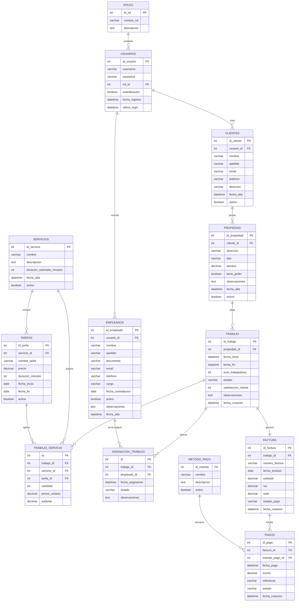

# Manual Técnico - GardenPro
**Sistema de Gestión para Empresas de Jardinería**
*Versión 1.0 - Elaborado por Antigravity*

---

## Índice
1. [Introducción](#1-introducción)
2. [Objetivo del Documento](#2-objetivo-del-documento)
3. [Descripción General de la Aplicación](#3-descripción-general-de-la-aplicación)
4. [Tecnologías Utilizadas](#4-tecnologías-utilizadas)
5. [Arquitectura del Sistema](#5-arquitectura-del-sistema)
6. [Requisitos de Hardware y Software](#6-requisitos-de-hardware-y-software)
7. [Estructura de la Base de Datos](#7-estructura-de-la-base-de-datos)
8. [Procedimiento de Instalación](#8-procedimiento-de-instalación)
9. [Procedimiento de Configuración](#9-procedimiento-de-configuración)
10. [Consideraciones de Seguridad](#10-consideraciones-de-seguridad)

---

## 1. Introducción

El presente **Manual Técnico** provee una descripción detallada de la arquitectura, diseño de base de datos, requerimientos técnicos, procesos de instalación y configuración de **GardenPro**, una solución web modular desarrollada para la automatización operativa y contable de empresas que prestan servicios de jardinería y paisajismo.

Este documento sirve como hoja de ruta para ingenieros de desarrollo, administradores de sistemas, personal de soporte técnico y DevOps que participen en las fases de despliegue, mantenimiento correctivo/preventivo y en la extensión o desarrollo de nuevos módulos para el sistema.

---

## 2. Objetivo del Documento

Definir los estándares técnicos de la plataforma GardenPro, con el fin de:
* Establecer las bases de la infraestructura de hardware y software requerida para el despliegue local o en entornos de servidor.
* Documentar de forma precisa el modelo de datos relacional y las vinculaciones de sus entidades para labores de mantenimiento y analítica.
* Guiar paso a paso al equipo técnico en la descarga, instalación, configuración e inicio de la aplicación.
* Exponer las consideraciones de seguridad integradas en el framework y la lógica de negocio para proteger la integridad de la información almacenada.

---

## 3. Descripción General de la Aplicación

**GardenPro** es una aplicación modular escrita en Python y estructurada en torno al framework web Django. La lógica de negocio está dividida en submódulos independientes organizados bajo el directorio de aplicaciones (`apps/`), cada uno encargado de resolver un dominio específico:

* **`usuarios`:** Gestiona el control de acceso, inicio de sesión, cambio de claves y la parametrización de los roles del sistema.
* **`clientes`:** Almacena la información de contacto de los clientes y los datos catastróficos/técnicos de sus propiedades.
* **`empleados`:** Administra el personal del negocio, sus roles de contratación y la lógica para validar documentos de identidad.
* **`servicios`:** Aloja el portafolio de servicios y la estructura de tarifas asociadas con fecha de vigencia.
* **`agenda`:** Controla la programación de visitas y las notificaciones o estados del servicio.
* **`trabajos`:** Centraliza las órdenes de trabajo, permitiendo vincular operarios y cargar servicios para calcular los importes a cobrar.
* **`facturacion`:** Procesa las órdenes de trabajo finalizadas para emitir comprobantes fiscales/comerciales aplicando el IVA correspondiente.
* **`pagos`:** Controla las formas de recaudo y registra los cobros recibidos para alimentar los informes contables.

---

## 4. Tecnologías Utilizadas

Para garantizar un funcionamiento óptimo, seguro y accesible desde cualquier dispositivo, la plataforma ha sido desarrollada implementando las siguientes tecnologías y herramientas estándar de la industria:

### A. Backend (Procesamiento y Lógica)
* **Python:** Lenguaje de programación de alto nivel que provee robustez, legibilidad y rapidez en la ejecución de la lógica del negocio.
* **Django Web Framework (versión 6.0.5):** Framework de desarrollo web basado en Python que implementa el patrón MVT (Modelo-Vista-Template). Se encarga de procesar la lógica de negocio, las sesiones de usuarios, la protección ante ataques comunes y el mapeo objeto-relacional (ORM) para la base de datos.

### B. Base de Datos (Almacenamiento)
* **SQLite:** Motor de base de datos relacional ligero e integrado. Se encarga de almacenar de manera estructurada y segura toda la información operativa del negocio (tablas de clientes, empleados, trabajos, facturas y registros de pago), garantizando una rápida respuesta a las consultas del sistema.

### C. Frontend (Interfaz de Usuario y Estilos)
* **HTML5 y Django Template Engine:** Utilizado para construir el esqueleto de las páginas web y renderizar de forma dinámica la información enviada desde el servidor.
* **Bootstrap CSS (versión 5.3.0):** Framework de diseño web que facilita la adaptabilidad de la interfaz (Diseño Responsivo), asegurando que el sistema se visualice correctamente tanto en computadoras de escritorio como en dispositivos móviles y tabletas.
* **CSS3 Personalizado (Vanilla CSS):** Hojas de estilo desarrolladas a la medida para aplicar la identidad visual del proyecto (tonos verdes inspirados en la naturaleza, tarjetas de información, barras laterales de navegación y animaciones sutiles).
* **JavaScript (Vanilla JS):** Utilizado para dotar de interactividad al navegador, como la apertura de menús flotantes, notificaciones dinámicas de alerta y validación básica de formularios en el cliente.

### D. Librerías Gráficas y de Iconos
* **Font Awesome (versión 6.4.0):** Conjunto de iconos vectoriales utilizado para la señalización visual de las acciones en la aplicación (iconos de calendario para la agenda, usuarios para clientes, facturas para finanzas, etc.).

---

## 5. Arquitectura del Sistema

La aplicación web ha sido desarrollada bajo la arquitectura y los estándares oficiales del framework Django, el cual implementa el patrón de diseño **MVT (Modelo-Vista-Template)**. Este patrón promueve la separación de responsabilidades, facilitando el mantenimiento, la escalabilidad y la seguridad de la aplicación.

### 1. Componentes de la Arquitectura (MVT)
* **Modelos (Models):** Representan la capa de datos. En esta capa se definen las tablas de la base de datos como objetos y clases de Python (ubicadas en los archivos `models.py` de cada aplicación). A través del ORM (Object-Relational Mapping) de Django, se realizan consultas, inserciones y eliminaciones de registros en la base de datos relacional de forma segura, evitando inyecciones SQL.
* **Vistas (Views):** Representan la capa lógica o de control (ubicadas en `views.py`). Reciben las peticiones del navegador, ejecutan la lógica del negocio (ej: verificar credenciales, calcular el subtotal de una factura, actualizar estados) y deciden qué plantilla HTML renderizar o a qué ruta redirigir al usuario.
* **Plantillas (Templates):** Representan la capa de presentación (archivos `.html`). Utilizan código HTML enriquecido con el motor de plantillas de Django para inyectar datos dinámicos provenientes de la base de datos en las pantallas del usuario. Se estructuran a partir de un archivo común (`base.html`) para mantener un diseño visual consistente.
* **Enrutador (URLs):** Es el mapa de navegación del sitio. Asocia las direcciones web (URLs) que digita el usuario o las acciones del navegador con su vista (controlador) correspondiente.

### 2. Flujo de Información y Petición HTTP
Cuando un usuario interactúa con la aplicación (por ejemplo, al registrar una nueva cita), el flujo de datos sigue este orden:

1. **Petición del Cliente:** El navegador del usuario envía una petición HTTP al servidor (por ejemplo, presionar el botón "Guardar Trabajo").
2. **Enrutamiento:** El sistema de URLs de Django recibe la dirección y la mapea con la función/vista responsable.
3. **Procesamiento de Lógica:** La vista ejecuta las validaciones. Si todo es correcto, solicita cambios al Modelo.
4. **Persistencia en Base de Datos:** El Modelo realiza la transacción física en el archivo de la base de datos SQLite (`db.sqlite3`).
5. **Renderizado Visual:** La vista toma la plantilla HTML correspondiente y le inyecta la información resultante.
6. **Respuesta al Cliente:** El servidor web devuelve el código HTML renderizado (con estilos CSS de Bootstrap e iconos de Font Awesome) al navegador para que el usuario visualice el cambio.

---

## 6. Requisitos de Hardware y Software

Para garantizar el despliegue y correcto funcionamiento de la plataforma GardenPro, los equipos y entornos deben cumplir con los siguientes requerimientos mínimos y recomendados:

### 1. Entorno del Servidor (Donde se ejecuta la aplicación)
Este entorno puede ser una máquina local de desarrollo o un servidor en la nube (VPS, Azure, AWS, Heroku, etc.).

#### A. Requisitos de Software
* **Sistema Operativo:** Windows (10/11 o Windows Server), Linux (Ubuntu, Debian, CentOS) o macOS.
* **Intérprete de Python:** Versión 3.10 o superior (Python 3.12 recomendado).
* **Dependencias de Librerías (según `requeriments.txt`):**
  * `Django == 6.0.5`
  * `sqlparse == 0.5.5`
  * `asgiref == 3.11.1`
  * `tzdata == 2026.2`
* **Base de Datos:** SQLite (v3.0 o superior, viene integrada nativamente con Python y no requiere software servidor adicional).

#### B. Requisitos de Hardware
* **Procesador (CPU):**
  * Mínimo: Dual-Core de 1.6 GHz.
  * Recomendado: Quad-Core de 2.0 GHz o superior.
* **Memoria RAM:**
  * Mínimo: 512 MB de RAM libres dedicadas al proceso de Django.
  * Recomendado: 2 GB de RAM o superior (dependiendo del flujo concurrente de peticiones).
* **Almacenamiento (Disco Duro):**
  * Mínimo: 200 MB de espacio libre (para el código fuente y dependencias).
  * Recomendado: 2 GB o más (para soportar el crecimiento del archivo de la base de datos `db.sqlite3` y almacenamiento de logs a largo plazo).

### 2. Entorno del Cliente (Dispositivos de los usuarios)
Dispositivos desde los cuales los administradores, operarios y contadores acceden al sistema mediante un navegador web.

#### A. Requisitos de Software
* **Navegador Web:** Cualquier navegador web moderno compatible con HTML5, CSS3 y JavaScript:
  * Google Chrome (versión 100+).
  * Mozilla Firefox (versión 100+).
  * Microsoft Edge (versión 100+).
  * Safari (versión 15+ para dispositivos Apple).
* **Sistema Operativo:** Windows, macOS, Android (para smartphones/tablets de operarios en campo) o iOS.

#### B. Requisitos de Hardware
* **Computadoras / Laptops:**
  * Procesador básico (Intel Celeron, Core i3 o equivalente).
  * Mínimo 2 GB de Memoria RAM libre para el navegador web.
* **Dispositivos Móviles (Teléfonos y Tablets):**
  * Dispositivo inteligente con pantalla de resolución mínima de 360px de ancho (para un despliegue óptimo del diseño responsivo de la barra lateral y tablas).
  * Conexión activa a Internet (Wi-Fi, 4G o 5G) para comunicarse con el servidor.

---

## 7. Estructura de la Base de Datos

La persistencia de datos de GardenPro se apoya en una base de datos relacional (implementada en SQLite para el desarrollo). A continuación, se presenta el Diagrama Entidad-Relación y la descripción de cada una de las tablas del esquema.

### 1. Diagrama Entidad-Relación (ERD)



### 2. Diccionario de Tablas y Entidades

#### A. Módulo de Seguridad y Accesos
1. **`ROLES` (Roles de Usuario):** Define los niveles de acceso del sistema.
   * `id_rol` (Integer, PK, Auto): Identificador único.
   * `nombre_rol` (Varchar, Único): Nombre del rol (ej: admin, supervisor).
   * `descripcion` (Text): Descripción de las funciones del rol.
2. **`USUARIOS` (Cuentas del Sistema):** Credenciales de acceso de los usuarios.
   * `id_usuario` (Integer, PK, Auto): Identificador único.
   * `username` (Varchar, Único): Nombre de inicio de sesión.
   * `password` (Varchar): Contraseña (encriptada en producción).
   * `rol_id` (Integer, FK -> ROLES): Rol asignado.
   * `autenticacion` (Boolean): Habilitado para iniciar sesión.
   * `fecha_registro` (DateTime): Registro de creación de cuenta.
   * `ultimo_login` (DateTime, Nulo): Historial de último acceso.

#### B. Módulo CRM (Clientes y Propiedades)
3. **`CLIENTES` (Directorio de Clientes):** Registra a los contratantes del servicio.
   * `id_cliente` (Integer, PK, Auto): Identificador único.
   * `usuario_id` (Integer, FK -> USUARIOS, Nulo): Usuario vinculado.
   * `nombre` (Varchar) y `apellido` (Varchar): Nombres completos.
   * `email` (Varchar, Único): Correo de facturación y contacto.
   * `telefono` (Varchar) y `direccion` (Varchar): Datos físicos de contacto.
   * `fecha_alta` (DateTime) y `activo` (Boolean).
4. **`PROPIEDAD` (Direcciones y Predios):** Espacios donde se ejecutan los servicios de jardinería.
   * `id_propiedad` (Integer, PK, Auto): Identificador único.
   * `cliente_id` (Integer, FK -> CLIENTES): Propietario del predio.
   * `direccion` (Varchar): Ubicación física de la propiedad.
   * `tipo` (Varchar): Categoría de inmueble (ej: Residencial, Finca, Comercial).
   * `tamano` (Decimal, Nulo): Medida en metros cuadrados ($m^2$).
   * `tiene_jardin` (Boolean) y `observaciones` (Text).

#### C. Módulo de Personal
5. **`EMPLEADOS` (Ficha del Personal):** Empleados operativos o administrativos.
   * `id_empleado` (Integer, PK, Auto): Identificador único.
   * `usuario_id` (Integer, FK -> USUARIOS, Nulo): Usuario de acceso al sistema.
   * `nombre` (Varchar), `apellido` (Varchar) y `documento` (Varchar, Único): Datos de identidad.
   * `email` (Varchar), `telefono` (Varchar), `cargo` (Varchar) y `fecha_contratacion` (Date).
   * `activo` (Boolean), `observaciones` (Text) y `fecha_alta` (DateTime).

#### D. Módulo de Servicios y Precios
6. **`SERVICIOS` (Catálogo de Servicios):** Portafolio de actividades ofrecidas.
   * `id_servicio` (Integer, PK, Auto): Identificador único.
   * `nombre` (Varchar, Único): Nombre del servicio (ej: Podado, Abonado).
   * `descripcion` (Text) y `duracion_estimada_minutos` (Integer).
7. **`TARIFAS` (Lista de Precios):** Valor monetario asignado a los servicios según su vigencia.
   * `id_tarifa` (Integer, PK, Auto): Identificador único.
   * `servicio_id` (Integer, FK -> SERVICIOS): Servicio al que se le asigna el precio.
   * `nombre_tarifa` (Varchar) y `precio` (Decimal).
   * `duracion_minutos` (Integer) y `fecha_inicio` (Date) / `fecha_fin` (Date, Nulo).
   * `activa` (Boolean).

#### E. Módulo Operativo (Trabajos y Asignaciones)
8. **`TRABAJO` (Órdenes Operativas):** Ficha de control de ejecución en campo.
   * `id_trabajo` (Integer, PK, Auto): Identificador único.
   * `propiedad_id` (Integer, FK -> PROPIEDAD): Predio donde se labora.
   * `fecha_inicio` (DateTime) y `fecha_fin` (DateTime, Nulo).
   * `num_trabajadores` (Integer), `estado` (Varchar) y `satisfaccion_cliente` (Integer, Nulo).
   * `observaciones` (Text).
9. **`TRABAJO_SERVICIO` (Detalle de Servicios Prestados):** Relación de cobro por trabajo.
   * `id` (Integer, PK, Auto): Identificador único.
   * `trabajo_id` (Integer, FK -> TRABAJO): Orden de trabajo.
   * `servicio_id` (Integer, FK -> SERVICIOS): Servicio prestado.
   * `tarifa_id` (Integer, FK -> TARIFAS, Nulo): Tarifa aplicada.
   * `cantidad` (Integer): Cantidades aplicadas.
   * `precio_unitario` (Decimal) y `subtotal` (Decimal): Cálculo de cobro.
10. **`ASIGNACION_TRABAJO` (Personal en Campo):** Relaciona empleados a cada orden de trabajo.
    * `id` (Integer, PK, Auto): Identificador único.
    * `trabajo_id` (Integer, FK -> TRABAJO) y `empleado_id` (Integer, FK -> EMPLEADOS).
    * `fecha_asignacion` (DateTime) y `estado` (Varchar).
    * `observaciones` (Text).

#### F. Módulo Comercial (Facturas y Pagos)
11. **`FACTURA` (Comprobantes de Venta):** Liquidación del servicio.
    * `id_factura` (Integer, PK, Auto): Identificador único.
    * `trabajo_id` (Integer, Relación Uno a Uno -> TRABAJO): Trabajo facturado.
    * `numero_factura` (Varchar, Único): Correlativo fiscal/comercial (ej: FAC-00001).
    * `fecha_emision` (Date), `subtotal` (Decimal), `iva` (Decimal) y `total` (Decimal).
    * `estado_pago` (Varchar, ej: pendiente, pagada).
12. **`METODO_PAGO` (Medios de Recaudo):** Canales autorizados.
    * `id_metodo` (Integer, PK, Auto): Identificador único.
    * `nombre` (Varchar, Único) y `descripcion` (Text).
    * `activo` (Boolean).
13. **`PAGOS` (Transacciones de Recaudo):** Registro de cobros aplicados a facturas.
    * `id_pago` (Integer, PK, Auto): Identificador único.
    * `factura_id` (Integer, FK -> FACTURA): Factura abonada/liquidada.
    * `metodo_pago_id` (Integer, FK -> METODO_PAGO): Canal de recepción del dinero.
    * `fecha_pago` (DateTime), `monto` (Decimal) y `referencia` (Varchar).
    * `estado` (Varchar).

---

## 8. Procedimiento de Instalación

Siga estos pasos para configurar el entorno de ejecución local en modo de desarrollo:

### Paso 1: Obtención del Código Fuente
Clone el repositorio del proyecto en su máquina local o extraiga el paquete de código fuente en su directorio de trabajo:
```bash
git clone <URL_DEL_REPOSITORIO>
cd Proyecto_Jardineria
```

### Paso 2: Creación del Entorno Virtual (Virtualenv)
Es una buena práctica aislar las dependencias del proyecto usando un entorno virtual de Python. Ejecute:
```bash
# Crear el entorno virtual
python -m venv venv
```

### Paso 3: Activación del Entorno Virtual
Active el entorno según su sistema operativo y terminal de trabajo:
* **En Windows (PowerShell):**
  ```powershell
  .\venv\Scripts\Activate.ps1
  ```
* **En Windows (CMD):**
  ```cmd
  .\venv\Scripts\activate.bat
  ```
* **En macOS / Linux (Terminal):**
  ```bash
  source venv/bin/activate
  ```

### Paso 4: Instalación de Dependencias
Instale las librerías necesarias especificadas en el archivo de requerimientos (observe que se encuentra escrito como `requeriments.txt` con un error tipográfico en el nombre del archivo):
```bash
pip install -r requeriments.txt
```

### Paso 5: Aplicación de Migraciones
Cree la estructura de la base de datos relacional de SQLite ejecutando el comando de migración de Django:
```bash
python manage.py migrate
```

### Paso 6: Creación de la Cuenta Administrativa (Opcional)
Para acceder al panel de administración nativo de Django, cree una cuenta de superusuario:
```bash
python manage.py createsuperuser
```
Siga las instrucciones en consola para definir el nombre de usuario, correo electrónico y contraseña.

### Paso 7: Inicio del Servidor de Desarrollo
Active el servidor web de pruebas integrado en Django:
```bash
python manage.py runserver
```
Por defecto, la aplicación estará disponible en la dirección local `http://127.0.0.1:8000/`.

---

## 9. Procedimiento de Configuración

La configuración del comportamiento de GardenPro se centraliza en el archivo `proyectojardineria/settings.py`. Los siguientes parámetros son críticos y deben ser validados por el área técnica:

### 1. Variables Clave en `settings.py`

* **`BASE_DIR`:** Define la raíz física del proyecto en el disco del servidor. Se calcula dinámicamente y se utiliza para ubicar carpetas de plantillas, recursos estáticos y el archivo de base de datos.
* **`SECRET_KEY`:** Clave criptográfica utilizada para firmar sesiones, cookies y tokens de seguridad. 
  > [!CAUTION]
  > Para entornos productivos, la clave generada por defecto en el archivo debe cambiarse y cargarse mediante una variable de entorno para evitar filtraciones de seguridad.
* **`DEBUG`:** Define si se muestran pantallas detalladas con información de errores de código. Está configurado como `True` para facilitar la depuración en desarrollo.
  > [!WARNING]
  > Para despliegues en producción, debe cambiarse estrictamente a `False`. De lo contrario, se expondrán archivos de código y credenciales a atacantes en caso de errores en tiempo de ejecución.
* **`ALLOWED_HOSTS`:** Arreglo que define las direcciones IP o nombres de dominio autorizados para servir la aplicación. En desarrollo se mantiene vacío `[]`, pero en servidores debe incluir la dirección exacta (ej: `['gardenpro.com', '192.168.1.100']`).

### 2. Configuración de Base de Datos
El motor configurado por defecto es SQLite, mapeado de la siguiente manera:
```python
DATABASES = {
    'default': {
        'ENGINE': 'django.db.backends.sqlite3',
        'NAME': BASE_DIR / 'db.sqlite3',
    }
}
```
Si se requiere migrar a un motor de base de datos en red de producción (como PostgreSQL o MariaDB), se debe modificar esta sección instalando su respectivo driver (ej: `psycopg2` para Postgres) y completando las variables de Host, User, Password y Puerto.

---

## 10. Consideraciones de Seguridad

**GardenPro** implementa medidas de protección integradas provistas por el framework Django y reforzadas mediante la lógica de desarrollo en los controladores:

### A. Control de Acceso por Sesiones (Session Auth)
En lugar de utilizar sistemas de tokens API o depender de cookies externas de terceros, el software gestiona la sesión de usuario de forma local del lado del servidor mediante el middleware `SessionMiddleware`.
* Al iniciar sesión con éxito (en `login_view`), se crean variables de sesión seguras:
  ```python
  request.session['usuario_id'] = usuario.id_usuario
  request.session['username'] = usuario.username
  request.session['rol'] = usuario.rol.nombre_rol
  request.session['logged_in'] = True
  ```
* Se implementa un decorador personalizado llamado `@verificar_sesion` en `apps/usuarios/views.py` que se antepone a todas las vistas protegidas:
  ```python
  def verificar_sesion(view_func):
      def wrapper(request, *args, **kwargs):
          if not request.session.get('logged_in'):
              messages.error(request, 'Debe iniciar sesión')
              return redirect('usuarios:login')
          return view_func(request, *args, **kwargs)
      return wrapper
  ```
  Esto bloquea cualquier intento de visualización de módulos mediante inyección directa de URLs en el navegador de usuarios no autenticados.

### B. Prevención de Inyecciones SQL (Django ORM)
El sistema no ejecuta consultas de bases de datos concatenando cadenas de texto (SQL crudo). Todas las operaciones de consulta, guardado o borrado se realizan mediante el **ORM de Django** (ej. `Usuario.objects.get()`, `Factura.objects.filter()`). El ORM utiliza consultas parametrizadas internamente, anulando por completo la posibilidad de inyecciones de código malicioso a través de formularios.

### C. Protección contra Falsificación de Petición en Sitios Cruzados (CSRF)
Todos los formularios interactivos que envían datos por método POST (de creación, edición, etc.) implementan obligatoriamente la etiqueta `` en sus plantillas y el middleware `CsrfViewMiddleware` está activo. Django validará un token único generado por sesión para certificar que el formulario fue enviado directamente desde la interfaz autorizada, impidiendo ataques del tipo secuestro de sesión (CSRF).

### D. Control de Usuarios Activos
El modelo `Usuario` posee un atributo booleano llamado `autenticacion`. Durante el proceso de validación en la vista de Login, el sistema comprueba este estado. Si el administrador desmarca la casilla del usuario, el inicio de sesión se le niega inmediatamente, sirviendo como un interruptor de apagado instantáneo de cuentas comprometidas o en desuso.
