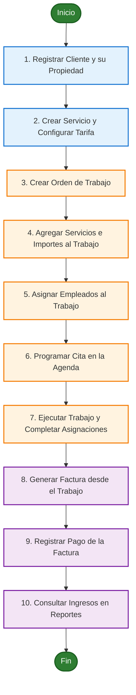

# Manual de Usuario - GardenPro
**Sistema de Gestión para Empresas de Jardinería**
*Versión 1.0 - Elaborado por Antigravity*

---

## Índice
1. [Introducción](#1-introducción)
2. [Objetivo del Sistema](#2-objetivo-del-sistema)
3. [Acceso al Sistema](#3-acceso-al-sistema)
4. [Descripción de Módulos](#4-descripción-de-módulos)
    - [Dashboard (Inicio)](#dashboard-inicio)
    - [Gestión de Usuarios y Roles](#gestión-de-usuarios-y-roles)
    - [Gestión de Clientes y Propiedades](#gestión-de-clientes-y-propiedades)
    - [Gestión de Empleados](#gestión-de-empleados)
    - [Servicios y Tarifas](#servicios-y-tarifas)
    - [Agenda de Citas](#agenda-de-citas)
    - [Gestión de Trabajos](#gestión-de-trabajos)
    - [Facturación](#facturación)
    - [Registro de Pagos](#registro-de-pagos)
5. [Procedimientos Paso a Paso (Flujo de Trabajo Operativo)](#5-procedimientos-paso-a-paso-flujo-de-trabajo-operativo)
    - [Diagrama de Flujo del Proceso](#diagrama-de-flujo-del-proceso)
    - [Paso 0: Configuración de Roles y Usuarios](#paso-0-configuración-de-roles-y-usuarios)
    - [Paso 1: Alta de un Cliente y su Propiedad](#paso-1-alta-de-un-cliente-y-su-propiedad)
    - [Paso 2: Configuración del Catálogo de Servicios y Tarifas](#paso-2-configuración-del-catálogo-de-servicios-y-tarifas)
    - [Paso 3: Creación de un Trabajo Operativo](#paso-3-creación-de-un-trabajo-operativo)
    - [Paso 4: Asignación de Servicios y Personal al Trabajo](#paso-4-asignación-de-servicios-y-personal-al-trabajo)
    - [Paso 5: Agendamiento de la Cita](#paso-5-agendamiento-de-la-cita)
    - [Paso 6: Finalización de Trabajo y Facturación](#paso-6-finalización-de-trabajo-y-facturación)
    - [Paso 7: Registro del Pago de la Factura](#paso-7-registro-del-pago-de-la-factura)
6. [Recomendaciones de Uso del Sistema](#6-recomendaciones-de-uso-del-sistema)
7. [Preguntas Frecuentes (FAQ)](#7-preguntas-frecuentes-faq)

---

## 1. Introducción

Bienvenido al manual de usuario de **GardenPro**, la plataforma web centralizada diseñada específicamente para la administración eficiente de empresas de jardinería. Este sistema facilita el control de las operaciones diarias, optimizando la comunicación entre las áreas de administración, personal de campo y clientes finales.

A través de una interfaz moderna y adaptativa, GardenPro le permite gestionar la base de datos de clientes, llevar una bitácora exacta de las propiedades y sus necesidades, programar citas de mantenimiento, asignar el personal técnico a órdenes de trabajo, facturar los servicios prestados y llevar un control riguroso de la facturación y los ingresos.

---

## 2. Objetivo del Sistema

El objetivo principal de **GardenPro** es digitalizar, unificar y automatizar los procesos operativos y financieros de la empresa de jardinería, permitiendo:
* **Centralización de la información:** Mantener registros detallados y actualizados de clientes, propiedades, personal e ingresos en una sola base de datos segura.
* **Optimización Operativa:** Minimizar errores de comunicación mediante la asignación clara de empleados a trabajos específicos y el control del estado de las citas en la agenda.
* **Control Financiero:** Agilizar la facturación de trabajos finalizados y registrar pagos, permitiendo generar reportes en tiempo real sobre el estado financiero del negocio.

---

## 3. Acceso al Sistema

Para iniciar sesión en **GardenPro**, siga estos pasos:

1. Abra su navegador web e ingrese a la dirección URL del sistema (habitualmente `http://localhost:8000/` o la dirección proporcionada por su administrador).
2. Se presentará la pantalla de inicio de sesión (Login). Ingrese su **Nombre de Usuario** (Username) y **Contraseña**.
3. Haga clic en el botón **Iniciar Sesión**.

> [!NOTE]
> * Para que el acceso sea exitoso, el administrador del sistema debe haber marcado su usuario con el estado de **Autenticación Permitida (Activo)**.
> * Una vez dentro del sistema, podrá visualizar su nombre y el rol asignado en la esquina superior derecha de la pantalla.
> * Para salir de forma segura, diríjase al final del menú lateral (Sidebar) y haga clic en **Cerrar Sesión**.

---

## 4. Descripción de Módulos

El sistema cuenta con un menú lateral izquierdo dividido en cuatro secciones principales: **Principal**, **Gestión**, **Financiero** y **Sistema**.

### Dashboard (Inicio)
Es la pantalla principal que se muestra inmediatamente después de iniciar sesión. Proporciona un resumen ejecutivo del estado del negocio mediante tarjetas estadísticas y accesos rápidos:
* **Indicadores Clave:** Total de clientes activos, total de empleados activos, trabajos actualmente en proceso e ingresos totales acumulados por facturas pagadas.
* **Citas de Hoy:** Tabla que muestra la hora, el cliente asociado, el empleado asignado y el estado de la cita programada para la fecha actual.
* **Facturas Pendientes:** Un listado rápido con las últimas 5 facturas que se encuentran pendientes de cobro, con acceso directo a sus detalles.
* **Accesos Rápidos:** Botones interactivos para crear rápidamente un *Nuevo Cliente*, *Nuevo Empleado*, *Nueva Cita* o *Nuevo Trabajo*.

### Gestión de Usuarios y Roles
Módulo dedicado a administrar las credenciales de acceso al software:
* **Usuarios:** Listado completo que indica la fecha de registro, el nombre de usuario, el rol asignado y si cuenta con permisos de inicio de sesión. Permite la creación de usuarios, edición de sus perfiles, eliminación y el cambio seguro de contraseñas.
* **Configuración (Roles):** Permite ver los roles definidos en el sistema (por ejemplo: `admin`, `recepcion`, `jardinero`) y dar de alta nuevos roles para segmentar los perfiles de los usuarios.

### Gestión de Clientes y Propiedades
Permite organizar la cartera de clientes y los terrenos bajo servicio:
* **Clientes:** Almacena la información de contacto de los clientes (Nombre, Apellidos, Correo Electrónico, Teléfono y Dirección fiscal).
* **Propiedades:** Cada cliente puede tener una o varias propiedades registradas. Para cada propiedad se registra la dirección física, el tipo (ej. casa residencial, jardín corporativo, parque de recreo), el tamaño en metros cuadrados, si posee o no jardín y observaciones específicas (ej. "Tener cuidado con el perro", "Requiere podadora de gran altura").

### Gestión de Empleados
Controla el listado del personal técnico y administrativo disponible:
* **Registro de Empleados:** Permite capturar el nombre, apellido, documento de identidad (DNI/Cédula), correo electrónico, teléfono, cargo (ej. Jardinero Principal, Diseñador de Paisajes), fecha de contratación y observaciones.
* **Validación de Documentos:** Mecanismo integrado para validar que el formato del documento de identidad del empleado cumpla con los estándares requeridos y no existan duplicados en el sistema.

### Servicios y Tarifas
Define la oferta comercial de la empresa:
* **Servicios:** Catálogo general de las actividades ofrecidas (ej. Poda de césped, Control de plagas, Diseño de paisaje, Instalación de riego automático). Registra el nombre del servicio, una descripción comercial y una duración estimada en minutos.
* **Tarifas:** Permite asignar precios a los servicios del catálogo. Cada tarifa posee un nombre específico (ej. Tarifa Básica Residencial, Tarifa Corporativa), el precio asignado, la duración alicable y fechas de vigencia (fecha de inicio y fin).

### Agenda de Citas
Calendario operativo del negocio:
* **Control de Citas:** Permite programar la visita de un empleado a un cliente para realizar un trabajo en un día y hora específicos.
* **Estados de la Cita:** Cada cita puede transicionar por diferentes estados para mantener al equipo coordinado:
  * `Pendiente`: Cita registrada pero no confirmada aún.
  * `Confirmada`: Cita agendada y aceptada por el cliente y el empleado.
  * `Cancelada`: Cita anulada por alguna de las partes.

### Gestión de Trabajos
Es el núcleo operativo del sistema. Representa una orden de servicio asignada a una propiedad determinada:
* **Orden de Trabajo:** Registra la propiedad a intervenir, la fecha estimada de inicio, la cantidad de trabajadores requeridos, el estado del trabajo y observaciones.
* **Detalle del Trabajo:** Permite ingresar a la orden para realizar dos acciones esenciales:
  1. **Agregar Servicios:** Seleccionar un servicio del catálogo, elegir la tarifa aplicable, definir la cantidad (ej. 3 horas de poda) y calcular de forma automática el subtotal y el importe total del trabajo.
  2. **Asignar Empleados:** Agregar al personal técnico encargado de realizar las labores.
* **Completar Asignación:** Permite actualizar el estado de las tareas del personal cuando culminan su labor en campo.

### Facturación
Módulo administrativo para cobrar los servicios:
* **Generación de Factura:** Una vez finalizado el trabajo operativo, el sistema permite generar una factura con un solo clic. El sistema toma automáticamente el importe total acumulado de los servicios asociados al trabajo.
* **Detalle de Factura:** Calcula de forma automática el IVA aplicable (configurado por defecto al 19%) sobre el subtotal para obtener el monto total de cobro. Controla el estado del pago (`pendiente` o `pagada`).

### Registro de Pagos
Control de ingresos financieros:
* **Métodos de Pago:** Gestión de las vías de cobro aceptadas por la empresa (ej. Efectivo, Transferencia Bancaria, Tarjeta de Crédito, Cheque).
* **Registro de Pagos:** Permite registrar los cobros realizados a las facturas pendientes. Se indica la factura que se abona, el método de pago empleado, la fecha, el monto cobrado y una referencia de transacción (ej. número de transferencia).
* **Reportes de Pagos:** Vista estadística que totaliza los montos cobrados en rangos de fechas o clasificados por método de pago para auditar las finanzas corporativas.

---

## 5. Procedimientos Paso a Paso (Flujo de Trabajo Operativo)

Para operar el sistema de forma correcta y fluida, se debe seguir el orden lógico del proceso de negocio. A continuación, se presenta el diagrama de flujo y los pasos detallados para completar un ciclo comercial completo:

### Diagrama de Flujo del Proceso

---

### Paso 0: Configuración de Roles y Usuarios

Antes de registrar empleados o clientes que requieran acceso al sistema, es recomendable definir los roles del sistema y luego dar de alta las cuentas de usuario.

#### A. Crear un nuevo Rol de Usuario:
1. Diríjase a la sección **Sistema** en la parte inferior del menú lateral.
2. Haga clic en la opción **Configuración** (esto le llevará al listado de Roles del Sistema `/usuarios/roles/`).
3. En la pantalla de Gestión de Roles, haga clic en el botón **Nuevo Rol** (esquina superior derecha).
4. Rellene el formulario con los siguientes campos:
   * **Nombre del Rol:** El identificador del rol (debe ser único y sin espacios, por ejemplo: `supervisor_campo`, `auxiliar_jardin`).
   * **Descripción:** Un texto breve que describa la función o el alcance de este rol.
5. Haga clic en el botón **Crear Rol**. El sistema guardará el nuevo rol y lo redirigirá a la lista de roles activos.

#### B. Crear un nuevo Usuario asignado a un Rol:
1. Diríjase al menú lateral, sección **Gestión**, y haga clic en **Usuarios**.
2. Haga clic en el botón **Crear Usuario** en la esquina superior derecha.
3. Rellene el formulario con la información solicitada:
   * **Usuario (Username):** Nombre único de inicio de sesión.
   * **Rol:** Seleccione el rol deseado del menú desplegable.
   * **Contraseña** y **Confirmar Contraseña** (debe tener al menos 6 caracteres).
   * **Autenticación (Permitir inicio de sesión):** Asegúrese de marcar esta casilla si desea que el usuario acceda a la plataforma.
4. Haga clic en el botón **Crear Usuario**.

---

### Paso 1: Alta de un Cliente y su Propiedad

Antes de programar cualquier trabajo, es obligatorio registrar al cliente y el terreno donde se prestará el servicio.

1. Vaya al menú lateral y seleccione **Clientes** (o pulse **Nuevo Cliente** en el Dashboard).
2. Haga clic en **Crear Cliente** en la esquina superior derecha.
3. Rellene el formulario con los datos requeridos:
   * **Nombre** y **Apellido**.
   * **Email** (debe ser único) y **Teléfono**.
   * **Dirección** de correspondencia o principal.
4. Presione **Guardar**.
5. Tras guardar al cliente, en su vista de detalle, desplácese a la sección de **Propiedades** y haga clic en **Registrar Propiedad**.
6. Escriba la dirección exacta de la propiedad, el tipo de terreno (Residencial, Industrial, Comercial), el tamaño (en $m^2$), si cuenta con jardín y agregue observaciones útiles para el jardinero.
7. Presione **Guardar Propiedad**.

---

### Paso 2: Configuración del Catálogo de Servicios y Tarifas

Defina qué servicios ofrece y cuánto cobrará por ellos.

1. Ingrese a **Servicios** en el menú de Gestión.
2. Haga clic en **Crear Servicio**. Rellene el nombre del servicio (ej. "Poda de Césped Estándar"), describa la actividad y estime la duración promedio en minutos. Haga clic en **Guardar**.
3. Regrese al listado y haga clic en el botón secundario **Ver Tarifas** o vaya a la sección de **Tarifas**.
4. Seleccione **Crear Tarifa**.
5. Asocie la tarifa al servicio creado, asígnele un nombre identificador (ej. "Tarifa de Verano"), el precio unitario (ej. `$25.00`), la duración en minutos y las fechas de vigencia.
6. Presione **Guardar Tarifa**.

---

### Paso 3: Creación de un Trabajo Operativo

Un trabajo es el contenedor que agrupa las tareas, recursos y fechas asociadas a un servicio contratado.

1. Diríjase a **Trabajos** en el menú de Gestión (o pulse **Nuevo Trabajo** en el Dashboard).
2. Haga clic en el botón **Crear Trabajo**.
3. Seleccione la **Propiedad** correspondiente al cliente que requiere el servicio.
4. Defina la **Fecha de Inicio** prevista y la cantidad estimada de trabajadores requeridos.
5. Seleccione el estado inicial del trabajo (ej. `Planificado` o `En Proceso`).
6. Ingrese observaciones iniciales y haga clic en **Guardar**.

---

### Paso 4: Asignación de Servicios y Personal al Trabajo

Una vez abierta la orden de trabajo, debe nutrirla de servicios cobrables y personal de campo.

1. En el listado de **Trabajos**, haga clic en **Detalle** (el icono de ojo o el número de trabajo) del elemento creado en el Paso 3.
2. En la sección de **Servicios del Trabajo**, haga clic en **Agregar Servicio**.
3. Seleccione el servicio específico y la tarifa correspondiente. Introduzca la cantidad (ej. si la tarifa es por hora, indique cuántas horas; si es por metro cuadrado, indique el área). El sistema multiplicará la cantidad por el precio unitario para rellenar el subtotal automáticamente.
4. Presione **Guardar**. Puede agregar múltiples servicios si el trabajo así lo requiere.
5. Desplácese a la sección de **Asignaciones de Empleados** y pulse **Asignar Empleado**.
6. Seleccione al técnico disponible en el menú desplegable, añada alguna nota si es necesario y pulse **Asignar**.

---

### Paso 5: Agendamiento de la Cita

Para establecer el día y la hora exacta de la visita técnica:

1. Diríjase a **Agenda** en el menú lateral.
2. Haga clic en **Crear Cita** (o acceda por el botón rápido de **Nueva Cita** en el Dashboard).
3. Seleccione el **Trabajo** (la orden creada en el Paso 3) y el **Cliente**.
4. Elija al **Empleado** que acudirá a la visita (debe ser uno de los asignados en el Paso 4).
5. Defina la **Fecha** y la **Hora** acordada con el cliente.
6. Marque el estado inicial como `Confirmada` o `Pendiente` según corresponda.
7. Presione **Guardar Cita**. La cita aparecerá ahora en la agenda y en la tabla "Citas de Hoy" del Dashboard de los usuarios involucrados cuando llegue la fecha programada.

---

### Paso 6: Finalización de Trabajo y Facturación

Cuando los operarios culminan sus tareas en el jardín del cliente:

1. Vaya a **Trabajos** y acceda al detalle de la orden.
2. En la sección de **Asignaciones**, pulse el botón **Completar Asignación** al lado del nombre de cada empleado asignado. Su estado cambiará a `completado`.
3. Edite la orden de trabajo general para marcar su estado global como `Completado`.
4. Una vez completado, en el panel lateral, diríjase a **Facturación** y seleccione la opción **Crear Factura**.
5. El sistema le pedirá asociar el trabajo finalizado. Selecciónelo.
6. El software importará automáticamente la suma de todos los servicios agregados a la orden (importe total), aplicará el **19% de IVA** y generará el total de la factura con un número de documento secuencial único.
7. Rellene la fecha de emisión y presione **Guardar**. La factura quedará registrada en estado `pendiente`.

---

### Paso 7: Registro del Pago de la Factura

El paso final cierra el ciclo financiero ingresando el dinero a la empresa.

1. Diríjase al menú lateral, sección Financiero, y seleccione **Pagos**.
2. Haga clic en **Crear Pago**.
3. Rellene el formulario:
   * **Factura:** Seleccione la factura pendiente del cliente.
   * **Método de Pago:** Seleccione cómo le pagaron (Efectivo, Tarjeta, Transferencia, etc. Si no existe el método, puede crearlo primero en la sección de **Métodos de Pago**).
   * **Fecha de Pago:** Ingrese el día y hora del abono.
   * **Monto:** Escriba el monto total recibido.
   * **Referencia:** Añada el código de transacción si aplica.
4. Presione **Guardar**. Al guardar el pago:
   * La factura asociada pasará automáticamente a estado `pagada`.
   * Los ingresos del Dashboard general se incrementarán con el total de esta factura.
5. Para verificar el flujo de caja global, vaya a la sección **Reportes** dentro de **Pagos**, donde podrá visualizar resúmenes gráficos y tabulares del dinero recaudado por método de pago y rango de fechas.

---

## 6. Recomendaciones de Uso del Sistema

Para garantizar una experiencia óptima y mantener la integridad de los datos de su empresa en **GardenPro**, le sugerimos seguir estas directrices de uso:

* **Respetar la secuencia lógica del flujo:** Siempre registre en primer lugar los roles, usuarios, clientes y propiedades antes de intentar abrir órdenes de trabajo o citas en la agenda. Esto evita listas desplegables vacías y advertencias del sistema.
* **Desactivar en lugar de eliminar:** Si un cliente, empleado o usuario deja de tener relación con la empresa, no los elimine. Desmarque la casilla de **Activo** (o desactive la **Autenticación** en usuarios). Esto preservará el historial de trabajos y cobros del pasado en la base de datos para auditorías financieras.
* **Mantenimiento preventivo del catálogo de tarifas:** Verifique periódicamente que los servicios tengan configurada al menos una tarifa activa y vigente (fechas de inicio y fin correctas). De esto depende que los subtotales en trabajos y facturas se calculen automáticamente sin intervención manual.
* **Registro inmediato de cobros:** Cuando reciba un pago, regístrelo de inmediato en el módulo de **Pagos** para cerrar el ciclo financiero de la factura asociada. Esto mantendrá al día los gráficos de ingresos y las estadísticas de flujo de caja en tiempo real del Dashboard.
* **Validación de documentos:** Antes de dar de alta a un nuevo empleado, utilice la herramienta de validación de documentos para asegurarse de que el formato sea el correcto y evitar registros duplicados.
* **Monitoreo diario del Dashboard:** Acostúmbrese a utilizar el Dashboard como su pantalla de inicio operativa. Le brindará una vista rápida de las citas técnicas de la jornada y de aquellas facturas pendientes de cobro que requieren gestiones de cobro urgentes.

---

## 7. Preguntas Frecuentes (FAQ)

### ¿Por qué no puedo generar una factura para un trabajo que acabo de crear?
Para que el sistema permita generar una factura desde el módulo de Facturación, la orden de trabajo asociada debe cumplir con dos requisitos previos:
1. Debe tener al menos un servicio con tarifa asignada en la sección **Servicios del Trabajo**.
2. Su estado general debe haberse modificado a **Completado** tras culminar las tareas operativas.

### ¿Qué ocurre si elimino un cliente o empleado con historial financiero en el sistema?
No se recomienda la eliminación física de registros. Si elimina un cliente o empleado que ya tiene facturas o pagos asociados, podría romper la integridad referencial de los reportes y causar fallos en las estadísticas. En su lugar, edite el perfil y desmarque la casilla **Activo**. El sistema los ocultará de las operaciones diarias pero mantendrá a salvo todo su historial para consultas contables.

### ¿Cómo cambio la contraseña de un usuario o del personal?
Diríjase a **Gestión -> Usuarios**. Haga clic en el botón de detalle (ojo) al lado del usuario en cuestión y seleccione la opción **Cambiar Contraseña**. 
* Si tiene rol de **Administrador**, podrá asignar una nueva clave directamente sin conocer la actual.
* Si es un usuario normal cambiando su propia contraseña, el sistema le solicitará ingresar su clave actual por motivos de seguridad antes de autorizar el cambio.

### ¿Por qué un servicio no se muestra con el precio correcto al agregarlo a un trabajo?
Esto sucede cuando el servicio seleccionado no tiene una tarifa activa o la fecha de inicio de la tarea no se encuentra dentro del rango de vigencia configurado en la tarifa. Ingrese a **Servicios -> Tarifas**, busque la tarifa asociada y verifique que la casilla **Activa** esté marcada y las fechas de vigencia incluyan la fecha actual del servicio.

### ¿Qué debo hacer si una cita en la agenda debe reprogramarse?
Diríjase al módulo de **Agenda** y ubique la cita. Haga clic en **Editar** para cambiar el día o la hora del servicio. Se recomienda cambiar temporalmente el estado de la cita a `Pendiente` hasta confirmar la disponibilidad horaria con el cliente y el empleado asignado, volviendo a marcarla como `Confirmada` una vez acordada la nueva fecha.

---

> [!TIP]
> **Consejo de Eficiencia:** Si desea ahorrar tiempo, mantenga el catálogo de **Servicios** y sus respectivas **Tarifas** siempre actualizados. De este modo, la generación de Órdenes de Trabajo y su posterior facturación se completará en cuestión de segundos de forma 100% automatizada.
